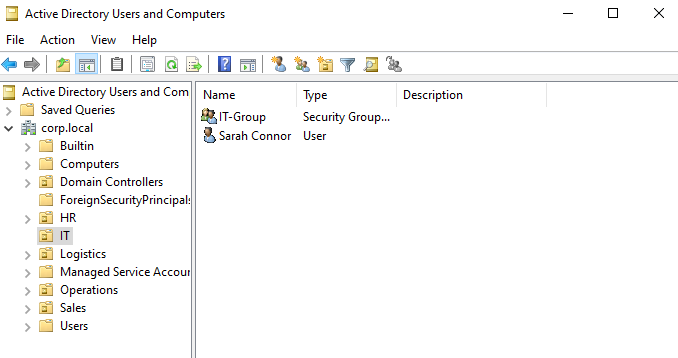
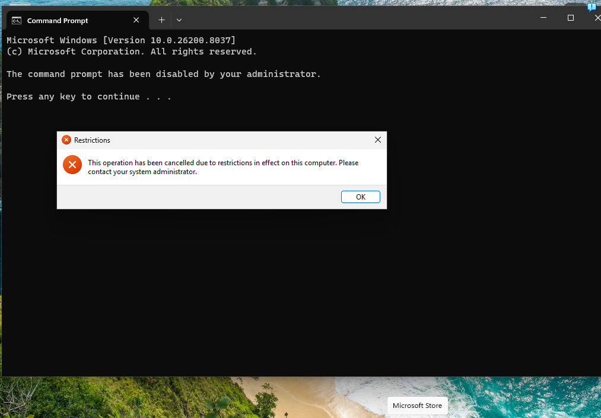
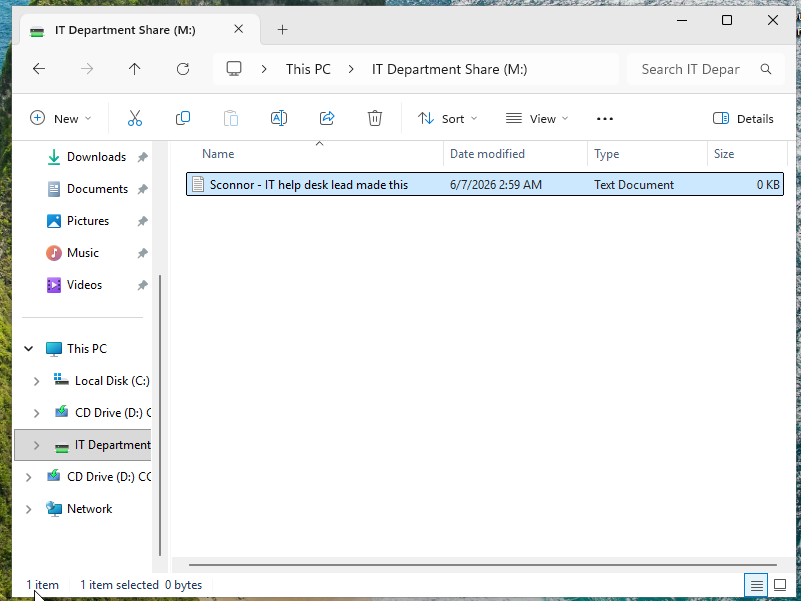
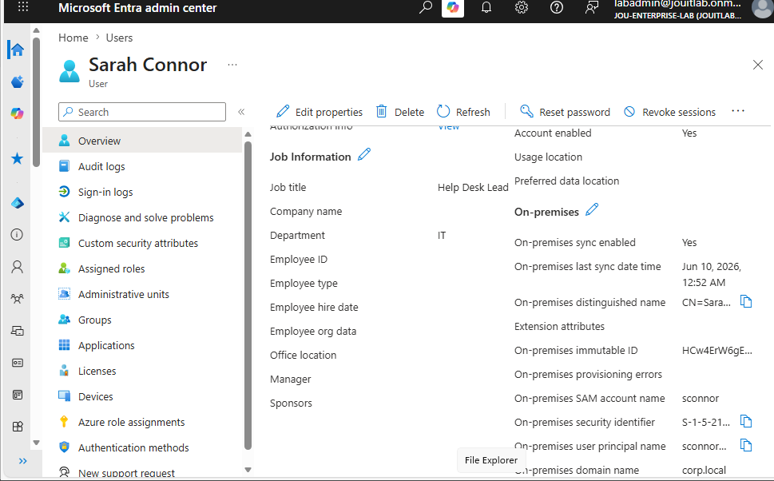
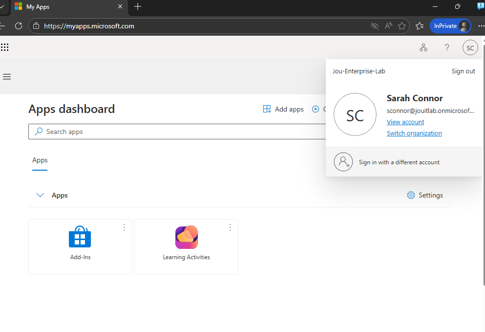

# Enterprise IT Home Lab: Automated Active Directory, Systems Hardening & Hybrid Cloud Integration

## 📌 Project Overview
This project demonstrates the deployment of a fully functional, secured hybrid enterprise network infrastructure built from scratch. The project showcases automated identity management, secure localized networking, group-policy-driven systems hardening, and a secure hybrid directory bridge extending on-premises assets to the cloud using Microsoft Entra ID.

---

## 🏗️ Architectural Topology
* **Hypervisor Platform:** VirtualBox
* **Private LAN Switch:** VirtualBox Internal Network (`IT-Lab`)
* **On-Premises Domain Controller (DC-01):** Windows Server 2022 *(Static IP: 192.168.10.10)*
* **Workstation Endpoint (PC-01):** Windows 11 Pro *(Domain-Joined)*
* **Cloud Tenant Identity Space:** Microsoft Entra ID (Workforce Tenant Sandbox)
* **Hybrid Sync Engine:** Microsoft Entra Connect Sync *(Password Hash Synchronization)*

---

## 🖼️ Functional Demonstration & Configuration Verification

The following live environment captures demonstrate the local Active Directory layout, policy enforcement, hybrid directory synchronization, and successful cloud user authentication across the lab infrastructure.

### 1. Active Directory Directory Services (AD DS) Core Structure
The centralized identity management database on `DC-01`, showing the programmatic structural separation of departments and explicit group assignments:

  

### 2. Live GPO Hardening & Security Enforcement (PC-01 Client View)
Proof of the centralized security baseline in action on the Windows 11 client machine. When standard user `sconnor` attempts to access administrative boundaries, the system explicitly terminates the request:

  

### 3. Automated Network Resource Provisioning & Write-Access Validation
The final state of the client environment upon successful network authentication. The GPO automatically mounts the department storage target (`M:` Drive), and file system permissions are validated via a successful remote file creation test:

  

### 4. Hybrid Identity Synchronization Matrix (Cloud Portal View)
Verification from within the Microsoft Entra Admin Center (`entra.microsoft.com`) showing that the local directory objects have replicated successfully to the cloud. The on-premises test user (`sconnor@...`) is actively mapped with the `On-premises sync enabled: Yes` attribute flag:

  <!-- TODO: Drop your Entra ID portal screenshot here -->
  

### 5. Single Sign-On (SSO) Hybrid Authentication
Proof of concept demonstrating a successful end-user cloud login via an isolated private browsing window at `myapps.microsoft.com`. The user successfully authenticates to global cloud resources using their local, on-premises Active Directory password credentials:

  <!-- TODO: Drop your myapps.microsoft.com login success screenshot here -->
  

---

## ⚡ Core Technical Milestones

### 1. Automated Identity Provisioning (PowerShell)
Developed and executed a PowerShell script to programmatically build an enterprise Organizational Unit (OU) structure and provision multi-departmental user accounts directly from an external CSV file data source.
* Enforced corporate security controls on user creation by passing the `-ChangePasswordAtLogon $true` parameters to mandate an initial credential reset upon first workstation initialization.

### 2. Group Policy Objects (GPO) Systems Hardening
Designed and linked centralized security baselines to enforce the **Principle of Least Privilege** across domain assets:
* **Administrative Lockdown:** Prohibited standard user access to the local OS Control Panel, Windows Settings interface, and administrative command shells (`cmd`).
* **Automated Asset Distribution:** Configured an automated GPO preference to mount departmental network share resources dynamically upon successful user authentication.

### 3. File Server Management & Double-Lock Permissions
Configured a centralized enterprise file repository enforcing rigorous multi-tier authentication protections:
* **The "Double-Lock" Model:** Integrated SMB Share Permissions (*Change/Read*) in tandem with underlying NTFS Access Control Lists (*Modify/Read*) to ensure seamless cross-departmental collaboration while preventing unauthorized sideways data access.

### 4. Hybrid Cloud Identity Integration (Microsoft Entra ID)
Extended the local private infrastructure to the cloud to achieve enterprise Identity & Access Management (IAM):
* **UPN Suffix Alignment:** Configured alternative User Principal Name (UPN) suffixes on the local Active Directory forest to match the internet-routable cloud tenant domain space (`@yourdomain.onmicrosoft.com`).
* **Sync Engine Implementation:** Deployed and configured the **Microsoft Entra Connect Sync** engine natively on the Domain Controller, utilizing Password Hash Synchronization (PHS) to securely map and replicate local identity profiles up to Microsoft's cloud infrastructure.

---

## 🛠️ Real-World Troubleshooting & Practical Resolutions

During development, several critical environment faults were encountered and systematically engineered through to resolution:

* **Issue: Microsoft Entra Connect Sync Setup Wizard Fails / Throws Validation Errors**
  * *Root Cause:* The initial installation was attempted using the primary tenant creator account (`...#EXT#@...`), which was an external guest account originating from a university student directory. The Entra Connect wizard lacked authorization to write background synchronization rules via external directory federations.
  * *Resolution:* Logged into the cloud admin panel to provision a native, pure cloud admin user account (`labadmin@yourdomain.onmicrosoft.com`) with top-tier **Global Administrator** privileges, uninstalled the failed sync software components, cleared the local SQL database fragments, and successfully completed the wizard using the new native cloud credentials.

* **Issue: "Active Directory Domain Controller (AD DC) Could Not Be Contacted"**
  * *Root Cause:* The Server VM adapter was misconfigured to default VirtualBox NAT instead of the internal network fabric, causing a localized network and DNS resolution disconnect.
  * *Resolution:* Remapped both VM adapters to a matching VirtualBox Internal Network string (`IT-Lab`), validated static DNS bindings via `nslookup`, and successfully established a domain connection.

* **Issue: Mapped Drive Access Permission Errors**
  * *Root Cause:* Active Directory domain users were authenticated through NTFS security configurations but lacked matching network-layer write access via SMB share policies.
  * *Resolution:* Re-engineered the file share's SMB permissions to elevate standard group roles from 'Read' to 'Change', resolving the conflict without introducing privilege creep.

---

## 🚀 Skills Demonstrated
* Hybrid Cloud Architecture & Identity Management (IAM)
* Microsoft Entra ID Tenant Provisioning & Portal Governance
* Microsoft Entra Connect Sync Engine (Password Hash Synchronization)
* Windows Server 2022 & Active Directory Domain Services (AD DS)
* PowerShell Automation & Scripting
* Hypervisor Network Engineering (NAT vs. Internal Switch Routing)
* Group Policy Management (GPOs)
* Network Share (SMB) & NTFS File Permissions Administration
